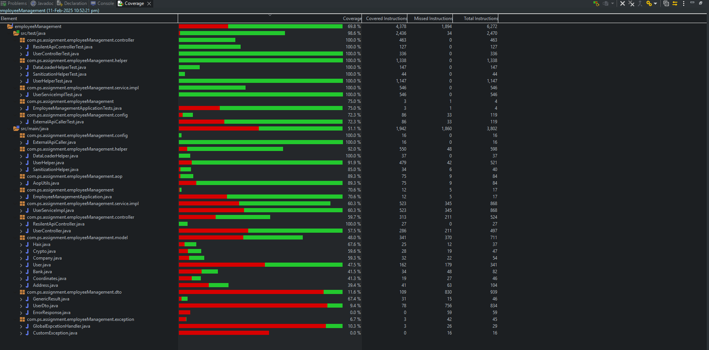

# Advanced User Details - Backend

This springboot based project consist of all the required backend entities:

1. During startup time data will be fetched from the external Api and saved it to the Database.
2. Currenty in this project in-memory H2 database is used.
3. Concepts of Resilience like circuit breaker and retrying are also implemented.
4. Proper custom exception classes are made in case of error response.
5. Apis are made to fetch data only.
6. There are four type searching -
            -- first name
            -- last name
            -- Ssn
            -- free search
    All are like search.
7. Also init Binders are applied to sanitize the illegal request data.
8. Junits are also implemented having test coverage of - 69.8%

9. For a small documentation user can refer to http://localhost:8080/swagger-ui/index.html#/
10. This documentation is made using swagger-ui

11. By default the service is runnin gon port 8080.